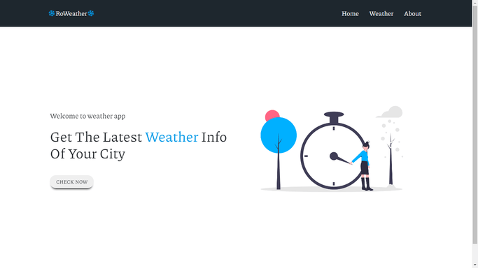

# Weather-App


implemented from the knowledge learnt from [Thapa Technical ](https://www.youtube.com/channel/UCwfaAHy4zQUb2APNOGXUCCA)

This is a front-end and Backend weather app that displays the weather data according to enter city.
API used from [openweather Api](https://openweathermap.org/)


## Technologies learnt and used

- **ES7** and **ES6** javascript syntax
- Node Js
- Express Js
- Template Engines(hbs)
- CSS designs to mimic the actual weather Website

Output can be viewed [**here**](https://weatherappusingne.herokuapp.com/)


## Installation

Use npm to install dependencies

run the following commands in terminal:

```javascript
npm install
npm start
```

